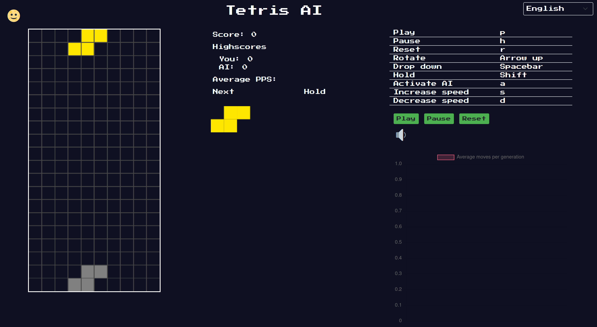

# Hi everyone!

I'm Matisse Callewaert, a software developer 👨‍💻 based in Belgium 🇧🇪.

I'm currently pursuing my master's in information technology at the University of Ghent. Alongside my studies, I work at a company where I contribute to maintaining and developing a SaaS application. During my free time, I indulge in coding web games 🎮, and lately, I've been delving into implementing microservice 🔬 techniques into my designs.
   
## Quick Overview

# My projects 🚀

| Sales2Cash 👔                                                                                                                                                                                                                                                                                           | Faction Game 🎲                                                                                                                                                                                                                                                                                                                       |
| ------------------------------------------------------------------------------------------------------------------------------------------------------------------------------------------------------------------------------------------------------------------------------------------------------ | ------------------------------------------------------------------------------------------------------------------------------------------------------------------------------------------------------------------------------------------------------------------------------------------------------------------------------------ |
| 
A SaaS solution enabling businesses to track invoices and optimize cash flow management. 
 | 
A programmer-centric game where factions compete for dominance by implementing custom decision logic for their units and bases. 
 |

| NulVision                                                                                                                                                                                                                                          | Tetris AI game :computer:                                                                                                                                                                                                                                                           |
| -------------------------------------------------------------------------------------------------------------------------------------------------------------------------------------------------------------------------------------------------- | ----------------------------------------------------------------------------------------------------------------------------------------------------------------------------------------------------------------------------------------------------------------------------------- |
| 
A web app to detect and identify objects in drone images. 
 | 
A website where you can train an AI to play tetris or play tetris yourself. 
 |

| RustiFlow ✍️                                                                                                                                                                                                                                                                      |
| ------------------------------------------------------------------------------------------------------------------------------------------------------------------------------------------------------------------------------------------------------------------------------------ |
| 
A tool for extracting features in network intrusion systems. <a href="https://github.com/matissecallewaert/nids-feature-extraction-tool">Repository</a> 
 |

# What I'm currently learning 📚

<ul>
<li>Rust</li>
<li>Microservices</li>
<li>eBPF</li>
</ul>

# Socials

  
  

