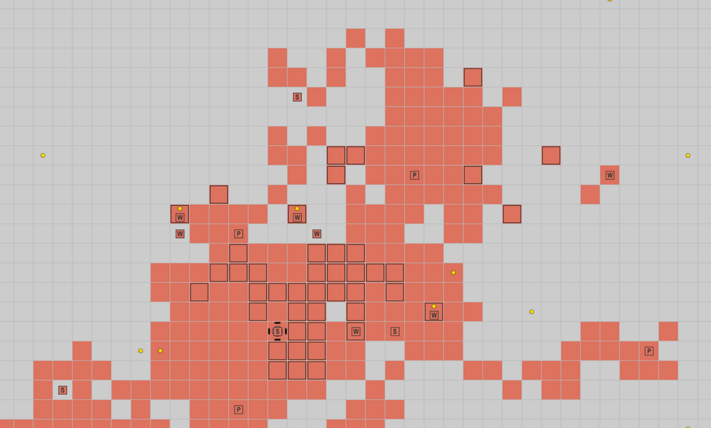
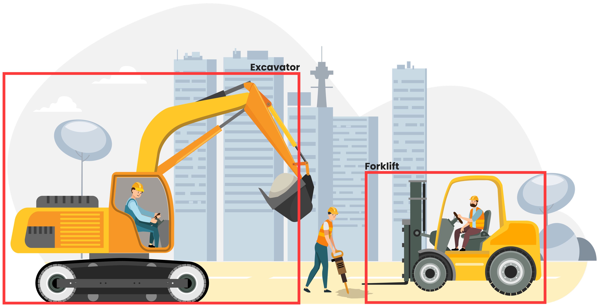
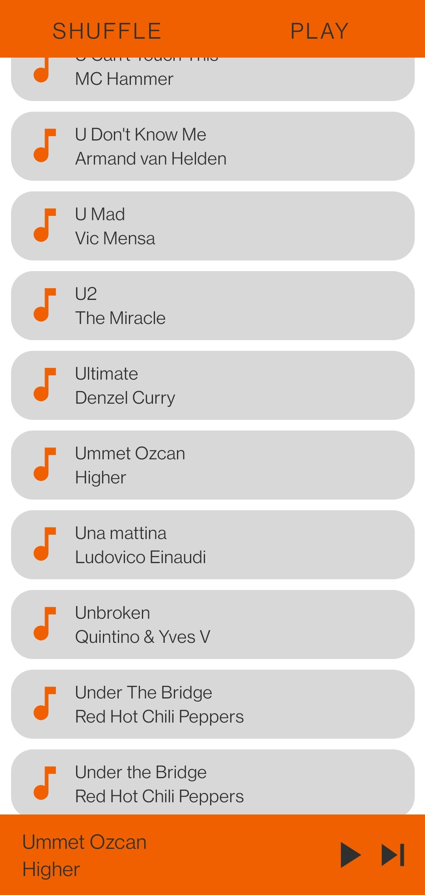

# Hi everyone!

I'm Matisse Callewaert, a software developer 👨‍💻 based in Belgium 🇧🇪.

I'm currently pursuing my master's in information technology at the University of Ghent. Alongside my studies, I work at a company where I contribute to maintaining and developing a SaaS application. During my free time, I indulge in coding web games 🎮, and lately, I've been delving into implementing microservice 🔬 techniques into my designs.

   
## Quick Overview

# My projects 🚀

## Sales2Cash 👔

A SaaS solution enabling businesses to track invoices and optimize cash flow management.

## Faction Game 🎲

A programmer-centric game where factions compete for dominance by implementing custom decision logic for their units and bases.

  

## NulVision

  A web app to detect and identify objects in drone images.

  

  

## Master thesis ✍️

  A tool for extracting features in network intrusion systems.

  

## Simple music player app 🎵

A straightforward music player app built using Kotlin.

# What I'm currently learning 📚

<ul>
<li>Rust</li>
<li>Microservices</li>
<li>eBPF</li>
</ul>

# Socials

  

